# Spam Classifier

#URL: https://spam-classifier-r58h.onrender.com/

A machine-learning web app that classifies SMS/email messages as **Spam** or **Not Spam**.
It uses a TF-IDF vectorizer + trained scikit-learn model, exposed through two interfaces:

- `app.py` — a **Flask** web app (HTML/CSS/JS frontend in `templates/` and `static/`)
- `hf.py` — a **Streamlit** app

## Project structure

```
project/
├── app.py                 # Flask web app
├── hf.py                  # Streamlit app
├── model1.pkl             # trained classifier
├── vectorizer1.pkl        # fitted TF-IDF vectorizer
├── spam_classifier_training.ipynb  # training notebook
├── templates/index.html   # Flask frontend
├── static/                # CSS + JS for the Flask frontend
├── requirements.txt       # Python dependencies
├── Procfile               # for Render deployment (Flask)
└── runtime.txt            # Python version for Render
```

## Training & Results

> Auto-generated from [`spam_classifier_training.ipynb`](spam_classifier_training.ipynb) — shows the dataset, EDA, preprocessing and model comparison.

(59241, 2)


<div>
<style scoped>
    .dataframe tbody tr th:only-of-type {
        vertical-align: middle;
    }

    .dataframe tbody tr th {
        vertical-align: top;
    }

    .dataframe thead th {
        text-align: right;
    }
</style>
<table border="1" class="dataframe">
  <thead>
    <tr style="text-align: right;">
      <th></th>
      <th>label</th>
      <th>text</th>
    </tr>
  </thead>
  <tbody>
    <tr>
      <th>45860</th>
      <td>spam</td>
      <td>to whom it may concern , online pharmacy medic...</td>
    </tr>
    <tr>
      <th>17381</th>
      <td>spam</td>
      <td>people who rech with world cup top up got free...</td>
    </tr>
    <tr>
      <th>24164</th>
      <td>ham</td>
      <td>i am working on clearing an old txu lone star ...</td>
    </tr>
    <tr>
      <th>16876</th>
      <td>spam</td>
      <td>win a hong kong trip only at blue hyundai duri...</td>
    </tr>
    <tr>
      <th>50528</th>
      <td>spam</td>
      <td>click here to be removed</td>
    </tr>
  </tbody>
</table>
</div>


    <class 'pandas.DataFrame'>
    RangeIndex: 59241 entries, 0 to 59240
    Data columns (total 2 columns):
     #   Column  Non-Null Count  Dtype
    ---  ------  --------------  -----
     0   label   59241 non-null  str  
     1   text    59241 non-null  str  
    dtypes: str(2)
    memory usage: 55.6 MB
    


<div>
<style scoped>
    .dataframe tbody tr th:only-of-type {
        vertical-align: middle;
    }

    .dataframe tbody tr th {
        vertical-align: top;
    }

    .dataframe thead th {
        text-align: right;
    }
</style>
<table border="1" class="dataframe">
  <thead>
    <tr style="text-align: right;">
      <th></th>
      <th>target</th>
      <th>text</th>
    </tr>
  </thead>
  <tbody>
    <tr>
      <th>57243</th>
      <td>spam</td>
      <td>canadian business publications 4865 hwy . 138 ...</td>
    </tr>
    <tr>
      <th>13530</th>
      <td>ham</td>
      <td>i thot d date tl nw would hve been a bit more ...</td>
    </tr>
    <tr>
      <th>4230</th>
      <td>ham</td>
      <td>Night night, see you tomorrow</td>
    </tr>
    <tr>
      <th>41443</th>
      <td>spam</td>
      <td>investor alert - l r c j - brand new stock for...</td>
    </tr>
    <tr>
      <th>50646</th>
      <td>ham</td>
      <td>hey leaders , ? as you know there will be a co...</td>
    </tr>
  </tbody>
</table>
</div>


<div>
<style scoped>
    .dataframe tbody tr th:only-of-type {
        vertical-align: middle;
    }

    .dataframe tbody tr th {
        vertical-align: top;
    }

    .dataframe thead th {
        text-align: right;
    }
</style>
<table border="1" class="dataframe">
  <thead>
    <tr style="text-align: right;">
      <th></th>
      <th>target</th>
      <th>text</th>
    </tr>
  </thead>
  <tbody>
    <tr>
      <th>0</th>
      <td>0</td>
      <td>Funny fact Nobody teaches volcanoes 2 erupt, t...</td>
    </tr>
    <tr>
      <th>1</th>
      <td>0</td>
      <td>I sent my scores to sophas and i had to do sec...</td>
    </tr>
    <tr>
      <th>2</th>
      <td>1</td>
      <td>We know someone who you know that fancies you....</td>
    </tr>
    <tr>
      <th>3</th>
      <td>0</td>
      <td>Only if you promise your getting out as SOON a...</td>
    </tr>
    <tr>
      <th>4</th>
      <td>1</td>
      <td>Congratulations ur awarded either �500 of CD...</td>
    </tr>
  </tbody>
</table>
</div>
Dataset shape: (54963, 2)

### EDA

### EDA


<div>
<style scoped>
    .dataframe tbody tr th:only-of-type {
        vertical-align: middle;
    }

    .dataframe tbody tr th {
        vertical-align: top;
    }

    .dataframe thead th {
        text-align: right;
    }
</style>
<table border="1" class="dataframe">
  <thead>
    <tr style="text-align: right;">
      <th></th>
      <th>target</th>
      <th>text</th>
    </tr>
  </thead>
  <tbody>
    <tr>
      <th>0</th>
      <td>0</td>
      <td>Funny fact Nobody teaches volcanoes 2 erupt, t...</td>
    </tr>
    <tr>
      <th>1</th>
      <td>0</td>
      <td>I sent my scores to sophas and i had to do sec...</td>
    </tr>
    <tr>
      <th>2</th>
      <td>1</td>
      <td>We know someone who you know that fancies you....</td>
    </tr>
    <tr>
      <th>3</th>
      <td>0</td>
      <td>Only if you promise your getting out as SOON a...</td>
    </tr>
    <tr>
      <th>4</th>
      <td>1</td>
      <td>Congratulations ur awarded either �500 of CD...</td>
    </tr>
  </tbody>
</table>
</div>


    target
    0    34336
    1    20627
    Name: count, dtype: int64


    
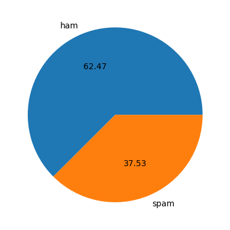
    


    


<div>
<style scoped>
    .dataframe tbody tr th:only-of-type {
        vertical-align: middle;
    }

    .dataframe tbody tr th {
        vertical-align: top;
    }

    .dataframe thead th {
        text-align: right;
    }
</style>
<table border="1" class="dataframe">
  <thead>
    <tr style="text-align: right;">
      <th></th>
      <th>target</th>
      <th>text</th>
      <th>num_characters</th>
    </tr>
  </thead>
  <tbody>
    <tr>
      <th>0</th>
      <td>0</td>
      <td>Funny fact Nobody teaches volcanoes 2 erupt, t...</td>
      <td>151</td>
    </tr>
    <tr>
      <th>1</th>
      <td>0</td>
      <td>I sent my scores to sophas and i had to do sec...</td>
      <td>221</td>
    </tr>
    <tr>
      <th>2</th>
      <td>1</td>
      <td>We know someone who you know that fancies you....</td>
      <td>101</td>
    </tr>
    <tr>
      <th>3</th>
      <td>0</td>
      <td>Only if you promise your getting out as SOON a...</td>
      <td>124</td>
    </tr>
    <tr>
      <th>4</th>
      <td>1</td>
      <td>Congratulations ur awarded either �500 of CD...</td>
      <td>152</td>
    </tr>
  </tbody>
</table>
</div>


<div>
<style scoped>
    .dataframe tbody tr th:only-of-type {
        vertical-align: middle;
    }

    .dataframe tbody tr th {
        vertical-align: top;
    }

    .dataframe thead th {
        text-align: right;
    }
</style>
<table border="1" class="dataframe">
  <thead>
    <tr style="text-align: right;">
      <th></th>
      <th>target</th>
      <th>text</th>
      <th>num_characters</th>
      <th>num_words</th>
    </tr>
  </thead>
  <tbody>
    <tr>
      <th>0</th>
      <td>0</td>
      <td>Funny fact Nobody teaches volcanoes 2 erupt, t...</td>
      <td>151</td>
      <td>28</td>
    </tr>
    <tr>
      <th>1</th>
      <td>0</td>
      <td>I sent my scores to sophas and i had to do sec...</td>
      <td>221</td>
      <td>47</td>
    </tr>
    <tr>
      <th>2</th>
      <td>1</td>
      <td>We know someone who you know that fancies you....</td>
      <td>101</td>
      <td>22</td>
    </tr>
    <tr>
      <th>3</th>
      <td>0</td>
      <td>Only if you promise your getting out as SOON a...</td>
      <td>124</td>
      <td>31</td>
    </tr>
    <tr>
      <th>4</th>
      <td>1</td>
      <td>Congratulations ur awarded either �500 of CD...</td>
      <td>152</td>
      <td>23</td>
    </tr>
  </tbody>
</table>
</div>


<div>
<style scoped>
    .dataframe tbody tr th:only-of-type {
        vertical-align: middle;
    }

    .dataframe tbody tr th {
        vertical-align: top;
    }

    .dataframe thead th {
        text-align: right;
    }
</style>
<table border="1" class="dataframe">
  <thead>
    <tr style="text-align: right;">
      <th></th>
      <th>target</th>
      <th>text</th>
      <th>num_characters</th>
      <th>num_words</th>
      <th>num_sentences</th>
    </tr>
  </thead>
  <tbody>
    <tr>
      <th>0</th>
      <td>0</td>
      <td>Funny fact Nobody teaches volcanoes 2 erupt, t...</td>
      <td>151</td>
      <td>28</td>
      <td>1</td>
    </tr>
    <tr>
      <th>1</th>
      <td>0</td>
      <td>I sent my scores to sophas and i had to do sec...</td>
      <td>221</td>
      <td>47</td>
      <td>3</td>
    </tr>
    <tr>
      <th>2</th>
      <td>1</td>
      <td>We know someone who you know that fancies you....</td>
      <td>101</td>
      <td>22</td>
      <td>3</td>
    </tr>
    <tr>
      <th>3</th>
      <td>0</td>
      <td>Only if you promise your getting out as SOON a...</td>
      <td>124</td>
      <td>31</td>
      <td>2</td>
    </tr>
    <tr>
      <th>4</th>
      <td>1</td>
      <td>Congratulations ur awarded either �500 of CD...</td>
      <td>152</td>
      <td>23</td>
      <td>1</td>
    </tr>
  </tbody>
</table>
</div>


<div>
<style scoped>
    .dataframe tbody tr th:only-of-type {
        vertical-align: middle;
    }

    .dataframe tbody tr th {
        vertical-align: top;
    }

    .dataframe thead th {
        text-align: right;
    }
</style>
<table border="1" class="dataframe">
  <thead>
    <tr style="text-align: right;">
      <th></th>
      <th>num_characters</th>
      <th>num_words</th>
      <th>num_sentences</th>
    </tr>
  </thead>
  <tbody>
    <tr>
      <th>count</th>
      <td>54963.000000</td>
      <td>54963.000000</td>
      <td>54963.000000</td>
    </tr>
    <tr>
      <th>mean</th>
      <td>915.599294</td>
      <td>186.266707</td>
      <td>10.537707</td>
    </tr>
    <tr>
      <th>std</th>
      <td>3128.337931</td>
      <td>624.916285</td>
      <td>42.536576</td>
    </tr>
    <tr>
      <th>min</th>
      <td>1.000000</td>
      <td>1.000000</td>
      <td>1.000000</td>
    </tr>
    <tr>
      <th>25%</th>
      <td>122.000000</td>
      <td>24.000000</td>
      <td>1.000000</td>
    </tr>
    <tr>
      <th>50%</th>
      <td>402.000000</td>
      <td>79.000000</td>
      <td>3.000000</td>
    </tr>
    <tr>
      <th>75%</th>
      <td>800.000000</td>
      <td>165.000000</td>
      <td>10.000000</td>
    </tr>
    <tr>
      <th>max</th>
      <td>228353.000000</td>
      <td>45450.000000</td>
      <td>3093.000000</td>
    </tr>
  </tbody>
</table>
</div>


<div>
<style scoped>
    .dataframe tbody tr th:only-of-type {
        vertical-align: middle;
    }

    .dataframe tbody tr th {
        vertical-align: top;
    }

    .dataframe thead th {
        text-align: right;
    }
</style>
<table border="1" class="dataframe">
  <thead>
    <tr style="text-align: right;">
      <th></th>
      <th>num_characters</th>
      <th>num_words</th>
      <th>num_sentences</th>
    </tr>
  </thead>
  <tbody>
    <tr>
      <th>count</th>
      <td>34336.000000</td>
      <td>34336.000000</td>
      <td>34336.000000</td>
    </tr>
    <tr>
      <th>mean</th>
      <td>868.274260</td>
      <td>181.902085</td>
      <td>9.248427</td>
    </tr>
    <tr>
      <th>std</th>
      <td>3736.613466</td>
      <td>746.824460</td>
      <td>45.068694</td>
    </tr>
    <tr>
      <th>min</th>
      <td>1.000000</td>
      <td>1.000000</td>
      <td>1.000000</td>
    </tr>
    <tr>
      <th>25%</th>
      <td>68.000000</td>
      <td>15.000000</td>
      <td>1.000000</td>
    </tr>
    <tr>
      <th>50%</th>
      <td>329.500000</td>
      <td>67.000000</td>
      <td>2.000000</td>
    </tr>
    <tr>
      <th>75%</th>
      <td>799.000000</td>
      <td>152.000000</td>
      <td>8.000000</td>
    </tr>
    <tr>
      <th>max</th>
      <td>228353.000000</td>
      <td>45450.000000</td>
      <td>2827.000000</td>
    </tr>
  </tbody>
</table>
</div>


<div>
<style scoped>
    .dataframe tbody tr th:only-of-type {
        vertical-align: middle;
    }

    .dataframe tbody tr th {
        vertical-align: top;
    }

    .dataframe thead th {
        text-align: right;
    }
</style>
<table border="1" class="dataframe">
  <thead>
    <tr style="text-align: right;">
      <th></th>
      <th>num_characters</th>
      <th>num_words</th>
      <th>num_sentences</th>
    </tr>
  </thead>
  <tbody>
    <tr>
      <th>count</th>
      <td>20627.000000</td>
      <td>20627.000000</td>
      <td>20627.000000</td>
    </tr>
    <tr>
      <th>mean</th>
      <td>994.377224</td>
      <td>193.532118</td>
      <td>12.683861</td>
    </tr>
    <tr>
      <th>std</th>
      <td>1681.022593</td>
      <td>334.786390</td>
      <td>37.852495</td>
    </tr>
    <tr>
      <th>min</th>
      <td>1.000000</td>
      <td>1.000000</td>
      <td>1.000000</td>
    </tr>
    <tr>
      <th>25%</th>
      <td>205.000000</td>
      <td>37.000000</td>
      <td>1.000000</td>
    </tr>
    <tr>
      <th>50%</th>
      <td>472.000000</td>
      <td>89.000000</td>
      <td>5.000000</td>
    </tr>
    <tr>
      <th>75%</th>
      <td>904.500000</td>
      <td>188.000000</td>
      <td>13.500000</td>
    </tr>
    <tr>
      <th>max</th>
      <td>28692.000000</td>
      <td>8386.000000</td>
      <td>3093.000000</td>
    </tr>
  </tbody>
</table>
</div>


    
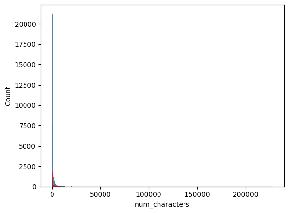
    


    
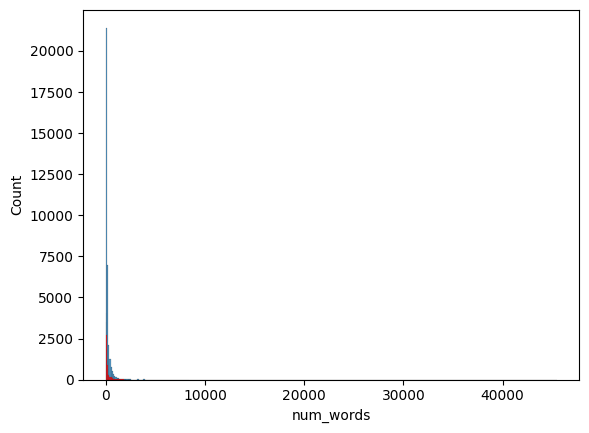
    


    
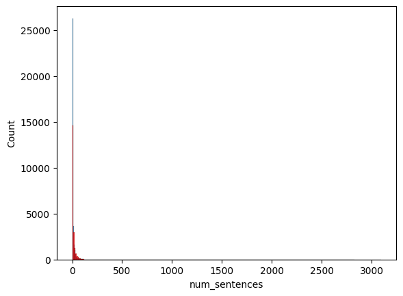
    


    
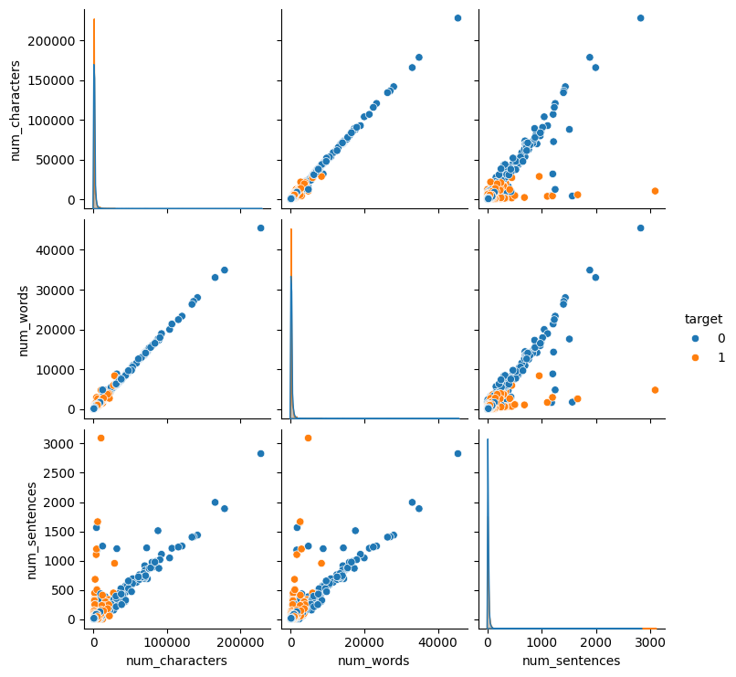
    


    
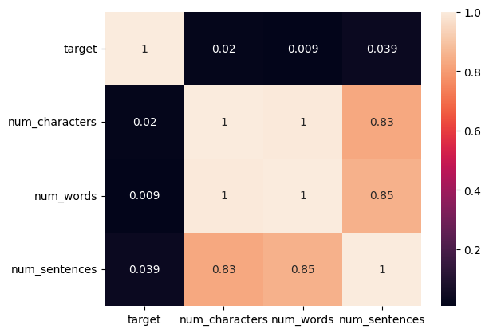
    


### Data Preprocessing


    'gon na home soon want talk stuff anymor tonight k cri enough today'


    'listen'


    'funni fact nobodi teach volcano 2 erupt tsunami 2 aris hurrican 2 sway aroundn 1 teach hw 2 choos wife natur disast happen'


<div>
<style scoped>
    .dataframe tbody tr th:only-of-type {
        vertical-align: middle;
    }

    .dataframe tbody tr th {
        vertical-align: top;
    }

    .dataframe thead th {
        text-align: right;
    }
</style>
<table border="1" class="dataframe">
  <thead>
    <tr style="text-align: right;">
      <th></th>
      <th>target</th>
      <th>text</th>
      <th>num_characters</th>
      <th>num_words</th>
      <th>num_sentences</th>
    </tr>
  </thead>
  <tbody>
    <tr>
      <th>0</th>
      <td>0</td>
      <td>Funny fact Nobody teaches volcanoes 2 erupt, t...</td>
      <td>151</td>
      <td>28</td>
      <td>1</td>
    </tr>
    <tr>
      <th>1</th>
      <td>0</td>
      <td>I sent my scores to sophas and i had to do sec...</td>
      <td>221</td>
      <td>47</td>
      <td>3</td>
    </tr>
    <tr>
      <th>2</th>
      <td>1</td>
      <td>We know someone who you know that fancies you....</td>
      <td>101</td>
      <td>22</td>
      <td>3</td>
    </tr>
    <tr>
      <th>3</th>
      <td>0</td>
      <td>Only if you promise your getting out as SOON a...</td>
      <td>124</td>
      <td>31</td>
      <td>2</td>
    </tr>
    <tr>
      <th>4</th>
      <td>1</td>
      <td>Congratulations ur awarded either �500 of CD...</td>
      <td>152</td>
      <td>23</td>
      <td>1</td>
    </tr>
  </tbody>
</table>
</div>


    Index(['target', 'text', 'num_characters', 'num_words', 'num_sentences'], dtype='str')


    
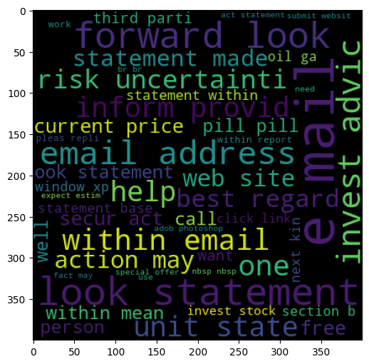
    


    
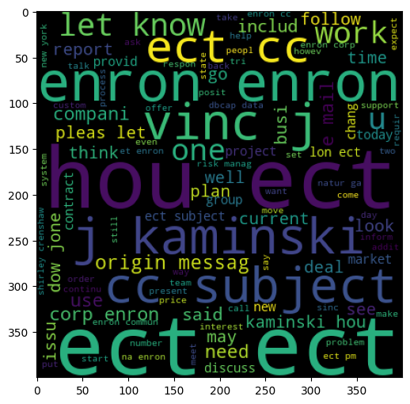
    


    2095815


    
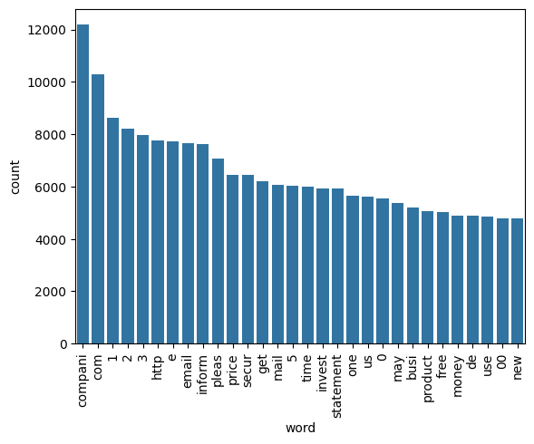
    


    3131927


    
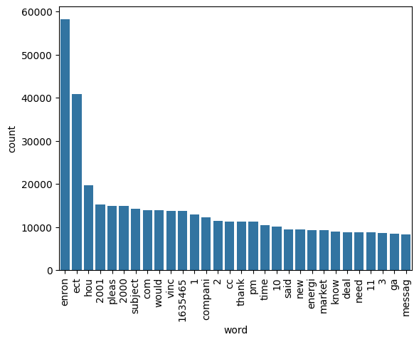
    


### Model

**Change vs. the original version:** `ngram_range=(1,2)` catches short spammy phrases
("call now", "click here") instead of only single words, `sublinear_tf=True` stops
very repetitive spam text ("FREE FREE FREE!!!") from dominating the vector, and
`min_df=2` drops one-off tokens that don't generalize.


    (54963, 6000)


    0.9196761575548076
    [[6360  507]
     [ 376 3750]]
    0.8809020436927414
    

    0.8757391067042664
    [[6761  106]
     [1260 2866]]
    0.9643337819650067
    

**Bug fix:** the `xgboost` import below was cut off in the original notebook
(`from xgboost` with no `import XGBClassifier`), which would crash this cell.
Also added `CalibratedClassifierCV` so `LinearSVC` can produce probability scores —
needed later for soft voting and for the confidence bar in the web app.

**Change:** `class_weight='balanced'` added to the linear models — spam datasets
are usually skewed toward ham, and without this the model quietly biases toward
predicting "not spam".

**Change:** this comparison loop was commented out in the original notebook, so
you never actually got to see which algorithm won — it's live now.

    For SVC
    Accuracy - 0.9449649777130902
    Precision - 0.9350135903138127
    F1 - 0.9259757738896366
    For KN
    Accuracy - 0.8042390612207768
    Precision - 0.771900826446281
    F1 - 0.7225373904074265
    For NB
    Accuracy - 0.9196761575548076
    Precision - 0.8809020436927414
    F1 - 0.8946677800310151
    For DT
    Accuracy - 0.7745838260711362
    Precision - 0.9199796126401631
    F1 - 0.592969776609724
    

    

    For LR
    Accuracy - 0.9389611570999727
    Precision - 0.9125865775017913
    F1 - 0.9192830506435703
    For RF
    Accuracy - 0.9508778313472209
    Precision - 0.9541540020263425
    F1 - 0.9331186524647015
    For AdaBoost
    Accuracy - 0.8227053579550623
    Precision - 0.8925351604760188
    F1 - 0.7174952891723438
    For BgC
    Accuracy - 0.9391430910579459
    Precision - 0.9296544867014666
    F1 - 0.9179040373051908
    For ETC
    Accuracy - 0.9576093877922314
    Precision - 0.9635258358662614
    F1 - 0.9422838741639832
    For GBDT
    Accuracy - 0.8468116073865187
    Precision - 0.9323654390934845
    F1 - 0.7576978417266187
    For xgb
    Accuracy - 0.9191303556808879
    Precision - 0.951968723820162
    F1 - 0.8846503178928247
    


<div>
<style scoped>
    .dataframe tbody tr th:only-of-type {
        vertical-align: middle;
    }

    .dataframe tbody tr th {
        vertical-align: top;
    }

    .dataframe thead th {
        text-align: right;
    }
</style>
<table border="1" class="dataframe">
  <thead>
    <tr style="text-align: right;">
      <th></th>
      <th>Algorithm</th>
      <th>Accuracy</th>
      <th>Precision</th>
      <th>F1</th>
    </tr>
  </thead>
  <tbody>
    <tr>
      <th>8</th>
      <td>ETC</td>
      <td>0.957609</td>
      <td>0.963526</td>
      <td>0.942284</td>
    </tr>
    <tr>
      <th>5</th>
      <td>RF</td>
      <td>0.950878</td>
      <td>0.954154</td>
      <td>0.933119</td>
    </tr>
    <tr>
      <th>0</th>
      <td>SVC</td>
      <td>0.944965</td>
      <td>0.935014</td>
      <td>0.925976</td>
    </tr>
    <tr>
      <th>4</th>
      <td>LR</td>
      <td>0.938961</td>
      <td>0.912587</td>
      <td>0.919283</td>
    </tr>
    <tr>
      <th>7</th>
      <td>BgC</td>
      <td>0.939143</td>
      <td>0.929654</td>
      <td>0.917904</td>
    </tr>
    <tr>
      <th>2</th>
      <td>NB</td>
      <td>0.919676</td>
      <td>0.880902</td>
      <td>0.894668</td>
    </tr>
    <tr>
      <th>10</th>
      <td>xgb</td>
      <td>0.919130</td>
      <td>0.951969</td>
      <td>0.884650</td>
    </tr>
    <tr>
      <th>9</th>
      <td>GBDT</td>
      <td>0.846812</td>
      <td>0.932365</td>
      <td>0.757698</td>
    </tr>
    <tr>
      <th>1</th>
      <td>KN</td>
      <td>0.804239</td>
      <td>0.771901</td>
      <td>0.722537</td>
    </tr>
    <tr>
      <th>6</th>
      <td>AdaBoost</td>
      <td>0.822705</td>
      <td>0.892535</td>
      <td>0.717495</td>
    </tr>
    <tr>
      <th>3</th>
      <td>DT</td>
      <td>0.774584</td>
      <td>0.919980</td>
      <td>0.592970</td>
    </tr>
  </tbody>
</table>
</div>


    
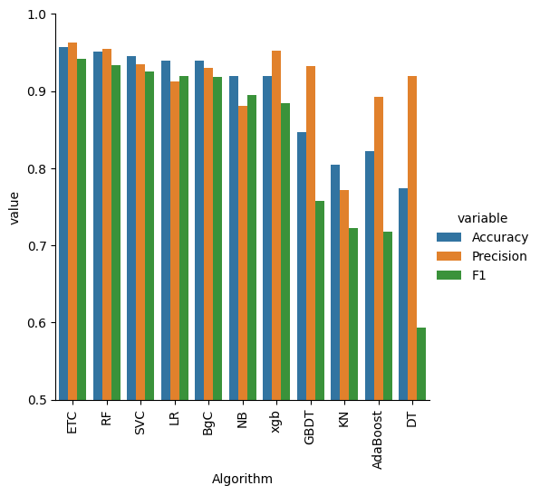
    


### Final model — soft-voting ensemble

**Change:** switched `voting='hard'` to `voting='soft'`. Hard voting only counts
majority votes and can't expose a confidence score. Soft voting averages predicted
probabilities across the three models, which tends to be a bit more accurate *and*
is what lets the web app show a confidence bar.

    Accuracy : 0.9545165105066861
    Precision: 0.9507707608155147
    F1       : 0.9386352479135984
    [[6669  198]
     [ 302 3824]]
    

### Optional: stacking classifier
Left here as an alternative worth trying — sometimes beats voting, sometimes doesn't,
depends on the dataset. Uncomment to test.

### Save for the Flask app
Refit on the *full* dataset (train + test) before saving, so the deployed model
isn't leaving 20% of your data on the table.

    Saved vectorizer1.pkl and model1.pkl

## Run locally

```bash
python -m venv venv
venv\Scripts\activate
pip install -r requirements.txt   # ignore the gunicorn error on Windows
python app.py                     # Flask  -> http://localhost:5000
# or
streamlit run hf.py               # Streamlit -> http://localhost:8501
```

## Deploy live (free)

### Option A — Streamlit Community Cloud (easiest)
1. Push this repo to GitHub.
2. Go to https://share.streamlit.io and sign in with GitHub.
3. "New app" -> pick this repo, set **Main file path** to `hf.py`, Deploy.

### Option B — Render (Flask app)
1. Push this repo to GitHub.
2. Go to https://render.com -> "New" -> "Web Service" -> connect the repo.
3. Build command: `pip install -r requirements.txt`
   Start command: `gunicorn app:app`
4. Render reads `runtime.txt` for the Python version.

## Model artifacts
`model1.pkl` and `vectorizer1.pkl` are required at runtime and are committed to the repo
so the deployed app works without retraining.
